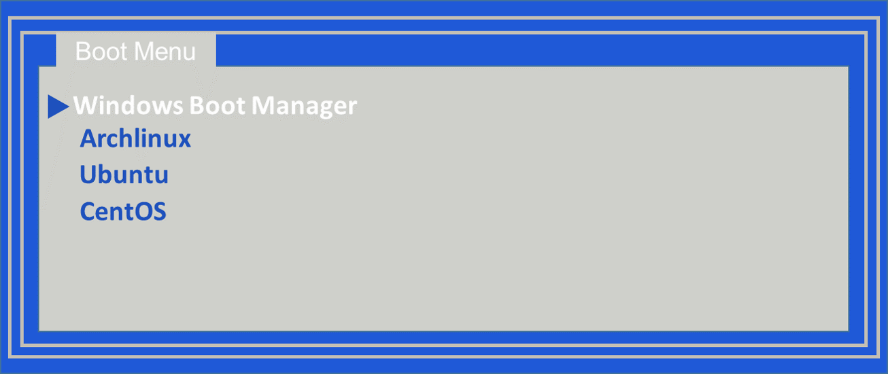

# Clear_UEFIBoot  
This program is used to clear UEFI boot order entry in NVRAM.  


# Usage
Note:You need to run this program with administrator rights.  
```
C:\Windows\system32>"C:\UEFI_BootOrder.exe"
All UEFI boot order entry in NVRAM have been cleared.

```
# How to verify
If you don’t see any item under the identifier {fwbootmgr}, it means that it was successfully cleared.
```
C:\Windows\system32>bcdedit /enum firmware
固件启动管理器
---------------------
标识符                  {fwbootmgr}
timeout                 0
Windows 启动管理器
--------------------
标识符                  {bootmgr}
...
```

# Credits
https://github.com/424778940z